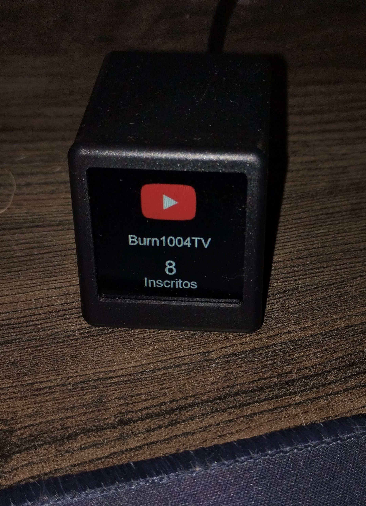

# Contador-de-Inscritos-Youtube---SmallTV-Ultra
Contador de Inscritos escrito em Python para a SmallTv Ultra 

Primeira versão funcional do código 

Link para telinha: https://pt.aliexpress.com/item/1005009995299512.html 
(Link sem afiliado por enquanto, pretendo mudar isso no futuro, mas quando o fizer avisarei aqui) 

Atenção, acredito ser compátivel com outras versões e variações da telinha, mas só tenho a Ultra para testar, por isso não posso dar certeza das outras... 

Tutorial: 

- Ligue o dispositivo e configure na rede conforme manual 
- Salve o IP que a tela pegou
- Configure a tela para formato "Photo Album"
- (Opcional, mas recomendado) Reserve o ip da tela no seu roteador, para evitar que se troque de IP quando o dispositivo for reiniciado
- Abra o programa, e na tela de configuração adicione o seu channel ID, sua chave de API e o IP do dispositivo
- Ao salvar, as atualizações já aparecerão na sua telinha

Futuro do projeto 
- Refatorar o cõdigo para torná-lo mais eficiente
- Adicionar mais opções de personalização ao visor, com adição de temas e afins
- Adicionar mais possibilidades de redes sociais
- Criar identidade Visual do software e uma interface mais bonita
- Fazer o programa rodar localmente na telinha, sem precisar do computador para atualização (será necessário soldar componentes para possibilitar o flash)

Obs: Código gerado via Vibe Coding usando ChatGPT, ainda estou começando a me aventurar nesse meio de programação e estou fazendo isso para ir treinando e aprendendo, se isso te incomoda, recomendo esperar as futuras atualizações aonde pretendo refatorar tudo sem o auxílio de IA`S

Agradecimentos e Inspirações 
- A minha esposa que apoia essas minhas loucuras 
- Aos amigos que sempre incentivaram eu ficar criando coisas
- Ao [Alexshch09](https://github.com/Alexshch09/geekmagic-smalltv-ultra-btc-tracker/tree/main) e [harusame3144](https://github.com/harusame3144/geekmagic-smalltv-spotify) que criaram códigos que me mostraram ser possível fazer essa adaptação
- A Comunidade do Home Assistant, que a partir [deste tópico](https://community.home-assistant.io/t/installing-esphome-on-geekmagic-smart-weather-clock-smalltv-pro/618029) me despertou a curiosidade por essa telinha e pelas possibilidades de criação com ela 
